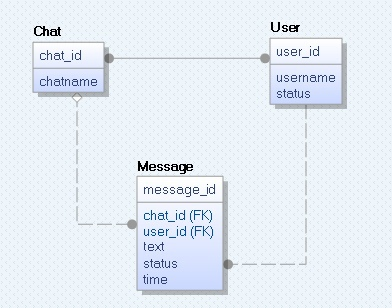

# Storage Service Configuration guide

Storage service uses MariaDB (community-developed fork of the MySQL relational database management system).

### Configuration example for Arch Linux:

1. Install MariaDB for server:
   ```bash
   sudo pacman -S mariadb
   sudo mariadb-install-db --user=mysql --basedir=/usr --datadir=/var/lib/mysql
   ```

2. Start MariaDB:
   ```bash
   sudo systemctl start mariadb
   ```

3. Secure MariaDB Installation:
   ```bash
   sudo mysql_secure_installation
   ```

4. Verify your root credentials by loggin on MariaDB:
   ```bash
   mysql -u root -p
   ```
   If you skipped secure installation (shame on you):
   ```bash
   sudo mysql -u root
   ```

5. Enter the following sql commands:
   ```sql
   CREATE DATABASE melon;
   CREATE USER 'melon'@'localhost' IDENTIFIED BY 'melonpass';
   GRANT ALL PRIVILEGES ON melon.* TO 'melon'@'localhost';
   quit;
   ```

6. Log as created user with created password:
   ```bash
   mysql -u melon -p
   ```
   You will be prompted to enter a password, enter `melonpass`.

7. Check that there is `melon` database:
   ```sql
   SHOW DATABASES LIKE 'melon';
   quit;
   ```

8. Create tables in `melon` database from db_scheme_dump.sql:
   ```bash
   mysql -u melon -p melon < sql/db_scheme_dump.sql
   ```

### Current Database Scheme Details



- **Domain**
  - `domain_id`:
    - *MariaDB type:* `BIGINT UNSIGNED NOT NULL AUTO_INCREMENT `
    - *C++ type:* `std::uint64_t`
    - *aim:* unique and auto-incremented value to identify domain name on server locally
  - `hostname`:
    - *MariaDB type:* `VARCHAR(255) COLLATE utf8mb4_unicode_ci NOT NULL UNIQUE KEY`
    - *C++ type:* `std::string`
    - *aim:* unique domain name
  - `external`:
    - *MariaDB type:* `BOOLEAN NOT NULL DEFAULT 0`
    - *C++ type:* `bool`
    - *aim:* flag to distinguish affiliation of domains

- **User**
  - `user_id` + `domain_id` - unique value to identify user globally
  - `user_id`:
    - *MariaDB type:* `BIGINT UNSIGNED NOT NULL`
    - *C++ type:* `std::uint64_t`
    - *aim:* unique and auto-increment value to identify user on server locally
  - `username`:
    - *MariaDB type:* `VARCHAR(255) COLLATE utf8mb4_unicode_ci NOT NULL`
    - *C++ type:* `std::string`
    - *aim:* unique name of user to identify user on server locally
  - `status`:
    - *MariaDB type:* `TINYINT UNSIGNED DEFAULT 0`
    - *C++ type:*  `enum class` value with underlying type `std::uint8_t` (ONLINE, OFFLINE, CHILL)
    - *aim:* expresses user's desire to communicate
  - `domain_id`: 
    - *MariaDB type:* `BIGINT UNSIGNED NOT NULL`
    - *C++ type:* `std::uint64_t`
    - *aim:* is used to create unique index in pair with `username` to uniquely identify user globally  

- **Chat**
  - `chat_id` + `domain_id` - unique value to identify chat globally
  - `chat_id`:
    - *MariaDB type:* `BIGINT UNSIGNED NOT NULL`
    - *C++ type:* `std::uint64_t`
    - *aim:* unique and auto-increment value to identify chat on server locally
  - `domain_id`: 
    - *MariaDB type:* `BIGINT UNSIGNED NOT NULL`
    - *C++ type:* `std::uint64_t`
    - *aim:* shows where chat is created
  - `chatname`:
    - *MariaDB type:* `VARCHAR(255) COLLATE utf8mb4_unicode_ci NOT NULL`
    - *C++ type:* `std::string`
    - *aim:* NOT unique chatname


- **Chat_User**
  - *aim*: matchs chats with participants (many-to-many relationship) 

- **Message**
  - `message_id` + `chat_id` + `domain_id_chat` - unique value to identify message globally
  - `message_id`:
    - *MariaDB type:* `BIGINT UNSIGNED NOT NULL`
    - *C++ type:* `std::uint64_t`
    - *aim:* unique and auto-increment value to identify message on server locally
  - `chat_id`:
    - *MariaDB type:* `BIGINT UNSIGNED NOT NULL`
    - *C++ type:* `std::uint64_t`
    - *aim:* shows which chat message relates to
  - `domain_id_chat`: 
    - *MariaDB type:* `BIGINT UNSIGNED NOT NULL`
    - *C++ type:* `std::uint64_t`
    - *aim:* shows where the chat which message relates to is created
  - `text` :
    - *MariaDB type:* `TEXT COLLATE utf8mb4_unicode_ci NOT NULL`
    - *C++ type:* `std::string`
    - *aim:* stores text of message
  - `status`:
    - *MariaDB type:* `TINYINT UNSIGNED DEFAULT 0`
    - *C++ type:* `enum class` value with underlying type `std::unint8_t` (SENT, FAIL, RECEIVED, SEEN)
    - *aim:* shows status of message
  - `sendtime`:
    - *MariaDB type:* `DATETIME NOT NULL`
    - *C++ type:* `std::chrono::system_clock::time_point`
    - *aim:* stores timestamp
  - `user_id`:
    - *MariaDB type:* `BIGINT UNSIGNED NOT NULL`
    - *C++ type:* `std::uint64_t`
    - *aim:* value to identify author of message `user_id` + `domain_id_user`
  - `domain_id_user`:
    - *MariaDB type:* `BIGINT UNSIGNED NOT NULL`
    - *C++ type:* `std::uint64_t`
    - *aim:* value to identify author of message `user_id` + `domain_id_user`
