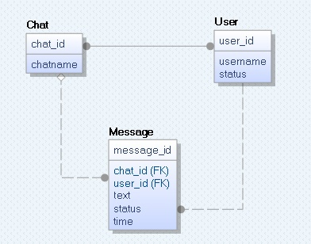

# Storage Service Configuration guide

Storage service uses  MariaDB (community-developed fork of the MySQL relational database management system).

### Configuration example for Arch Linux:

#### 1. Install MariaDB for server:
`sudo pacman -S mariadb/sudo pacman -S mysql`
   
#### 2. Start MariaDB:
`sudo systemctl start mysqld`
   
#### 3. Securing MariaDB Installation:
`sudo mysql_secure_installation`
 
#### 4. Verify your root credentials by loggin on MariaDB:
`mysql -u root -p`

or if you skipped secure installation (shame on you): `sudo mysql -u root`
 
#### 5. Enter/copy-paste sql commands:
```sql
CREATE DATABASE melon;
CREATE USER 'melon'@'localhost' IDENTIFIED BY 'melonpass';
GRANT ALL PRIVILEGES ON melon.* TO 'melon'@'localhost'; 
```
`quit;`

#### 6. Log as created user with created password:
```
mysql -u melon -p
(enter melonpass)
```

#### 7. Check that there is `melon` database:
```sql
SHOW DATABASES LIKE 'melon';
```
`quit;`
 
#### 8. Create tables in `melon` database from melondb.sql:
```bash
mysql -u melon -p melon < script/melondb.sql 
```
     
 ### Current Database Scheme Details



* #### User

   * `user_id` :

      * **MariaDB type:** `BIGINT UNSIGNED NOT NULL AUTO_INCREMENT`

      * **C++ type:** `std::uint64_t`

      * **aim:** unique and auto-increment value to identify user on server locally

   * `username` :

      * **MariaDB type:** `VARCHAR(255) COLLATE utf8mb4_unicode_ci NOT NULL`

      * **C++ type:** `std::string`

      * **aim:**  unique name of user to identify user on server locally

   * `status` : 

      * **MariaDB type:** `TINYINT UNSIGNED DEFAULT 0`

      * **C++ type:**  `enum class` value of type `std::unint8_t` (ONLINE, OFFLINE, CHILL)

      * **aim:** expresses user's desire to communicate


* #### Message

   * `message_id` :

      * **MariaDB type:** `BIGINT UNSIGNED NOT NULL AUTO_INCREMENT`

      * **C++ type:** `std::uint64_t`

      * **aim:** unique and auto-increment value to identify message on server locally

   * `chat_id` :

      * **MariaDB type:** `INT UNSIGNED NOT NULL`

      * **C++ type:** `std::uint32_t`

      * **aim:** value to identify message's relation to chat on server locally


   * `user_id` :

      * **MariaDB type:** `BIGINT UNSIGNED NOT NULL`

      * **C++ type:** `std::uint64_t`

      * **aim:** value to identify author of message on server locally

   * `text` :

      * **MariaDB type:** `VARCHAR(1024) COLLATE utf8mb4_unicode_ci NOT NULL`

      * **C++ type:** `std::string`

      * **aim:** stores text of message

   * `status` : 

      * **MariaDB type:** `TINYINT UNSIGNED DEFAULT 0`

      * **C++ type:**  `enum class` value of type `std::unint8_t` (SENT, FAIL, RECEIVED, SEEN)

      * **aim:** shows status of message

   * `time` :

      * **MariaDB type:** `DATETIME NOT NULL`

      * **C++ type:**  `std::chrono::high_resolution_clock::time_point`

      * **aim:** stores timestamp

* #### Chat

   * `chat_id` :

      * **MariaDB type:** `INT UNSIGNED NOT NULL AUTO_INCREMENT`

      * **C++ type:** `std::uint32_t`

      * **aim:** unique and auto-increment value to identify chat on server locally

   * `chatname` :

      * **MariaDB type:** `VARCHAR(255) COLLATE utf8mb4_unicode_ci NOT NULL`

      * **C++ type:** `std::string`

      * **aim:**  NOT unique chatname


